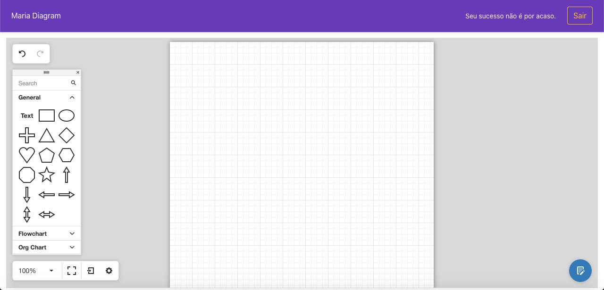

# Maria Diagram App


### Angular flow Diagrams + NodeJS + Express + MongoDB
![version][version-badge] ![Idioma][idioma] ![status][status-emprogresso]
#
### Para rodar este projeto é necessário
#### Clonar o repositório
```javascript
$ git clone https://github.com/TomCosta/maria-diagram.git
``` 
#### Entrar na pasta do projeto
```javascript
$ cd mariaApp
``` 
#### Entrar na pasta do aplicativo
```javascript
$ cd maria-graph
``` 
### Reinstalar as dependências
```bash
$ npm install
```
### Rodar localmente no navegador
```bash
$ ng serve --open
```
#
## Run the MongoDB
Check how to install MongoDB on: [MongoDB Community Edition](https://docs.mongodb.com/manual/tutorial/install-mongodb-on-os-x/#install-mongodb-community-edition)

### Rodar o MongoDB
```bash
$ mongod
```
### Parar de rodar o MongoDB
```bash
$ Ctrl + C
```
### Rodar o MongoDB se estiver uando Mac OSX
```bash
$ brew services start mongodb-community
```
### Parar de rodar o MongoDB no Mac OSX
```bash
$ brew services stop mongodb-community
```
#
## Run the Local Server
#### Entrar na pasta do server
```javascript
$ cd server
``` 
### Reinstalar as dependências
```bash
$ npm install
```
### Rodar o server
```bash
$ nodemon
```
### Parar de rodar o server
```bash
$ Ctrl + C
```

#

[CHANGELOG]: ./CHANGELOG.md
[version-badge]: https://img.shields.io/badge/version-1.0.0-blue.svg
[license-badge]: https://img.shields.io/badge/license-MIT-blue.svg
[status-emprogresso]: https://img.shields.io/badge/status-Em%20progresso-blueviolet
[idioma]: https://img.shields.io/badge/idioma-Portugu%C3%AAs-800060